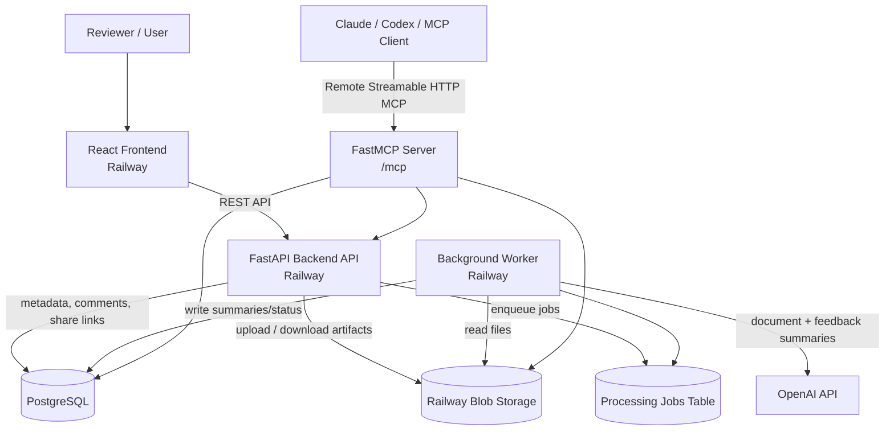

# Artifact Hub

**Production URL:** https://frontend-production-9e52.up.railway.app/  
**Repository:** https://github.com/AvishKadakia/ezra-round-2

## Architecture



## Folder Structure

```txt
.
├── frontend/
│   ├── src/
│   │   ├── components/      # Reusable UI, artifact cards, modals, review panels
│   │   ├── hooks/           # React Query hooks for API data fetching
│   │   ├── lib/             # API client and shared frontend contracts
│   │   └── pages/           # Gallery, review, shared artifact pages
│   ├── package.json
│   ├── vite.config.ts
│   └── railway.toml
│
├── backend/
│   ├── app/
│   │   ├── api/             # FastAPI routes
│   │   ├── core/            # Settings and environment config
│   │   ├── db/              # Database session/init/repair scripts
│   │   ├── services/        # Storage, summaries, feedback, queue logic
│   │   ├── main.py          # FastAPI app + MCP mount
│   │   ├── mcp_server.py    # Remote FastMCP tools/resources/prompts
│   │   ├── models.py        # SQLAlchemy models
│   │   ├── schemas.py       # Pydantic response/request schemas
│   │   └── worker.py        # Background artifact processor
│   ├── requirements.txt
│   ├── railway.toml
│   └── railway.worker.toml
│
├── Makefile #For local deployment
├── README.md
└── WRITEUP.md
```

## MCP Configuration

The backend exposes a remote MCP server. Reviewers do not need to run a local MCP server.

**Remote MCP endpoint:**

```txt
https://backend-api-production-a545.up.railway.app/mcp
```

The app also exposes these details in the UI through the **MCP Config** modal.

### Claude / Remote MCP URL

```txt
https://backend-api-production-a545.up.railway.app/mcp
```

### Claude Messages API-style config

```json
{
  "mcp_servers": [
    {
      "type": "url",
      "name": "artifact-hub",
      "url": "https://backend-api-production-a545.up.railway.app/mcp"
    }
  ]
}
```

### Codex `config.toml` snippet

```toml
[mcp_servers.artifact-hub]
url = "https://backend-api-production-a545.up.railway.app/mcp"
```

### MCP Capabilities


| MCP Tool                       | One-line description                                                                                               |
| ------------------------------ | ------------------------------------------------------------------------------------------------------------------ |
| `search_artifacts_for_review`  | Search the artifact gallery and return review-ready artifact context based on query, type, status, or limit.       |
| `get_artifact_review_brief`    | Fetch a complete review brief for one artifact, including metadata, summaries, comments, status, and next actions. |
| `triage_review_queue`          | Prioritize artifacts that need attention by grouping failed, processing, and ready-with-feedback items.            |
| `add_structured_feedback`      | Add a structured comment such as a question, blocker, decision, or praise to an artifact.                          |
| `refresh_feedback_summary`     | Regenerate the AI feedback summary for an artifact based on its latest comments.                                   |
| `queue_document_processing`    | Requeue an artifact for background processing to regenerate document or visual summaries.                          |
| `create_review_share_link`     | Create a time-limited share link for an artifact with safety warnings when it is not ready or has blockers.        |
| `plan_artifact_review_work`    | Build an agentic review plan for a stated goal using current artifact state and recommended next actions.          |
| `publish_artifact_from_base64` | Upload an image or PDF through remote MCP using base64 file content and queue it for gallery processing.           |
