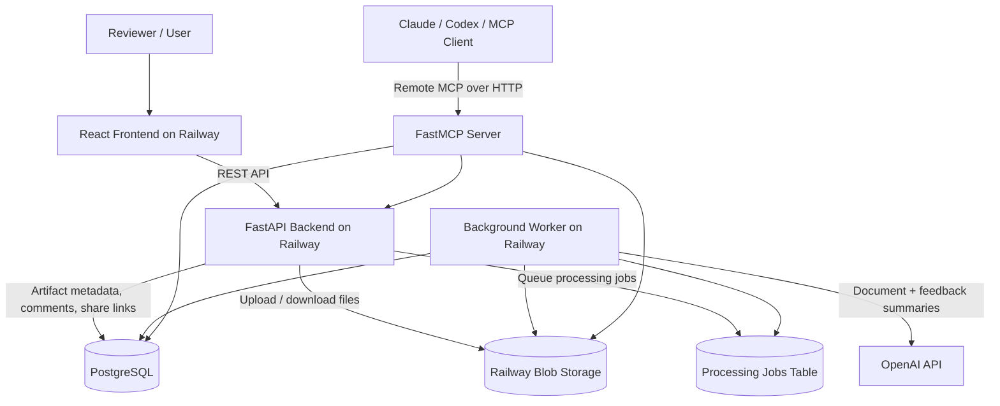

# Artifact Hub — Round 2 Submission

**Repository:** https://github.com/AvishKadakia/ezra-round-2  
**Production URL:** https://frontend-production-9e52.up.railway.app/

## What I Built and Why

Artifact Hub is a full-stack platform for publishing, browsing, reviewing, and sharing AI-generated artifacts such as images and PDFs.

The goal was to solve the messy post-generation lifecycle of AI outputs: files scattered across blob storage, feedback spread across threads, and no easy way to browse, review, or share generated work. I focused on a polished core workflow that a team could realistically use:

- Publish artifacts with metadata such as title, description, tags, and category.
- Browse artifacts in a gallery with filtering and sorting.
- Open an artifact detail page for preview, summaries, and feedback.
- Share artifacts through time-limited links.
- Leave structured feedback and automatically summarize comments.
- Use a remote MCP server so agents can inspect, triage, comment on, share, and upload artifacts conversationally.

I prioritized a working, deployed product over a large feature set because the challenge was time-boxed to two days.

## AI Usage Disclosure

I iterated exclusively with **ChatGPT** during this challenge. I did **not** use Claude Code, so this repository does not include `.claude/` project files or Claude Code session logs.

I used ChatGPT for:

- Breaking down the challenge requirements.
- Brainstorming API structure and database schema.
- Designing the frontend component architecture.
- Debugging backend, blob storage, Railway deployment, and MCP integration issues.
- Planning production deployment and documentation.

I implemented and tested the system locally, connected PostgreSQL and blob storage, created the GitHub repository, and deployed the production version.

## Architecture Overview

Artifact Hub uses a monorepo structure:

```txt
/frontend  React + TypeScript + Vite
/backend   FastAPI + PostgreSQL + Railway Blob Storage + FastMCP
```

The backend stores metadata in PostgreSQL and raw artifact files in Railway-compatible blob storage. Heavy artifact processing runs asynchronously through a background worker so uploads do not block the UI.



## MCP Integration

The MCP server is implemented with **FastMCP** and hosted remotely as part of the backend. I intentionally chose a remote MCP design so reviewers can connect without running a local server or setup script.

The MCP server exposes agent-friendly tools, not just CRUD wrappers. Examples include:

- `search_artifacts_for_review`
- `get_artifact_review_brief`
- `triage_review_queue`
- `add_structured_feedback`
- `refresh_feedback_summary`
- `queue_document_processing`
- `create_review_share_link`
- `plan_artifact_review_work`
- `publish_artifact_from_base64`

These tools are designed around review workflows. For example, an agent can triage the gallery, inspect artifacts with comments, summarize feedback, add structured review notes, and create a short-lived share link when appropriate.

### MCP Trade-off

Because the MCP server is fully remote, it cannot directly read local laptop file paths such as:

```txt
/Users/me/Desktop/file.pdf
```

To keep the experience remote-only, artifact upload through MCP uses base64 file content. This lets a chatbot pass attached file content to the remote MCP server, but it introduces practical limits around file size and payload size. With more time, I would add a local MCP companion script or presigned upload flow for larger files.

## Where LLM Capabilities Are Used

I used LLM capabilities where they improve the product experience rather than feeling bolted on:

1. **Document summaries** — Uploaded images and PDFs are summarized so reviewers can quickly understand artifact content.
2. **Page-level PDF summaries** — PDFs are rendered page-by-page and summarized visually.
3. **Feedback summaries** — When comments are added to an artifact, the backend generates a concise summary of the review conversation, highlighting blockers and next actions.
4. **MCP-native review workflows** — The MCP integration lets an AI agent reason over artifact state, comments, processing status, and review actions conversationally.

## Deployment Approach

The application is deployed on Railway:

- Frontend: React/Vite app served publicly.
- Backend API: FastAPI service.
- Worker: Separate Railway service that processes queued artifact jobs.
- Database: Railway PostgreSQL.
- Blob Storage: Railway-compatible object storage.

I set up a minimal CI/CD flow focused on getting the production system live quickly. The app is publicly accessible and does not require local setup for normal review.

## What I Chose Not to Build

Given the two-day timebox, I intentionally skipped or limited several areas.

### Authentication

I did not implement full user login or role-based permissions. For a production system, authentication would be required before exposing mutating MCP tools or private artifacts.

### Automated Tests

I relied on manual QA instead of automated test coverage. I prioritized a working deployed product over a broader test suite.

### Admin Dashboard

There is no dedicated admin console for revoking links, managing users, or clearing data. I added core operational support, but not a polished admin surface.

### Large-scale Gallery Pagination

The gallery supports browsing, filtering, and sorting, but not yet pagination or lazy loading. This would be important as artifact volume grows.

### Full Local MCP Upload Flow

The current remote MCP supports base64 upload. A local MCP script would allow direct file publishing from a user’s machine without base64 size limitations.

## Next Steps With Another Week

If I had another week, I would focus on:

1. **Authentication and access control** — User login, private artifacts, and role-based MCP permissions.
2. **Admin dashboard** — Revoke share links, extend link expiry, retry failed processing jobs, and clear staging data safely.
3. **Performance and caching** — Add Redis caching and deduplicate uploads by file hash to avoid repeated LLM processing for identical files.
4. **Gallery scalability** — Add pagination or infinite scroll with server-side sorting/filtering.
5. **Improved MCP upload options** — Add a local MCP helper for raw file uploads and a presigned upload flow for larger files.
6. **Automated testing** — Add backend API tests, upload/worker tests, frontend smoke tests, and MCP tool integration tests.

## Brief Walkthrough

### 1. Publish an Artifact

1. Open the production URL.
2. Click **Publish**.
3. Select one or more image/PDF files.
4. Add title prefix, description, category, and tags.
5. Submit the upload.
6. The artifact appears in the gallery as **Processing**.
7. The background worker processes the file and updates it to **Ready**.

### 2. Browse the Gallery

1. Use the gallery to view all published artifacts.
2. Filter by type or status.
3. Sort by newest, oldest, recently updated, most comments, title, status, or document type.
4. Click any card to open the artifact detail page.

### 3. Review an Artifact

1. Open an artifact from the gallery.
2. View the file preview.
3. Read the generated document summary.
4. Add structured feedback in the review panel.
5. Once comments exist, the app generates a feedback summary.

### 4. Share an Artifact

1. Open an artifact detail page.
2. Click the share button.
3. Choose a time-limited access window.
4. Copy the generated share link.
5. Open the link in a new browser tab to verify public access.

### 5. Use MCP

1. Open the MCP configuration modal in the app.
2. Copy the remote MCP URL.
3. Add it to a compatible MCP client such as Claude or MCP Inspector.
4. Ask the agent to triage the artifact review queue.
5. The agent can inspect artifacts, summarize feedback, add comments, create share links, and upload artifacts through MCP-supported payloads.

Example prompt:

```txt
Use the Artifact Hub MCP server to triage my review queue. Find artifacts with comments, summarize the main blockers, and recommend next actions.
```

## Claude Code Session Files

I did not use Claude Code for this project. Therefore, this repository does not include `.claude/` project files or `claude-sessions/` logs.

I used ChatGPT as my AI assistant and documented that workflow above.
